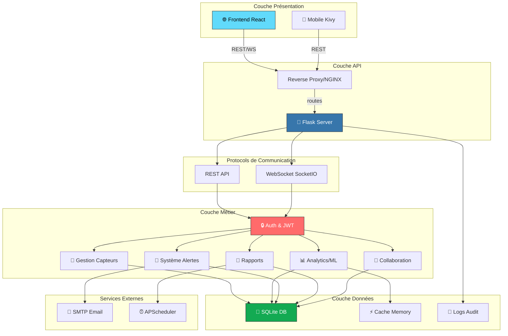
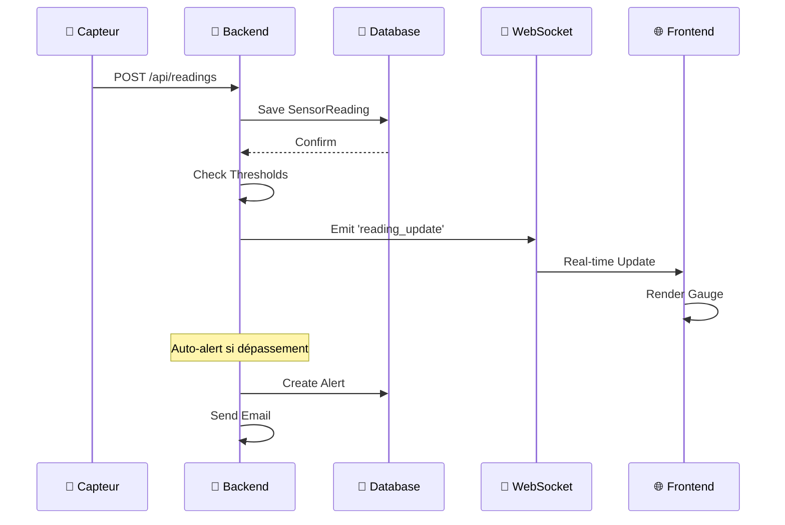
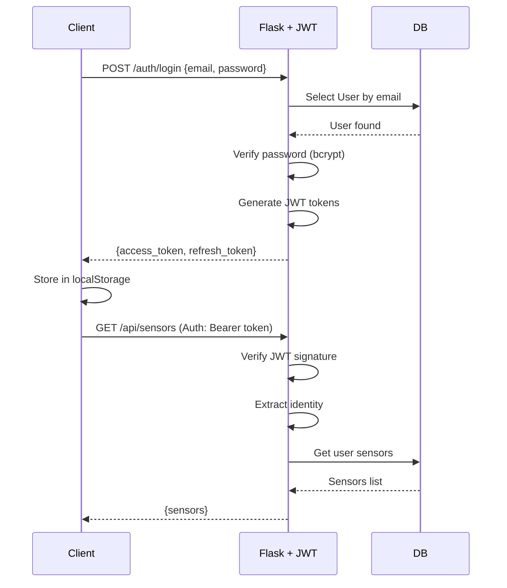
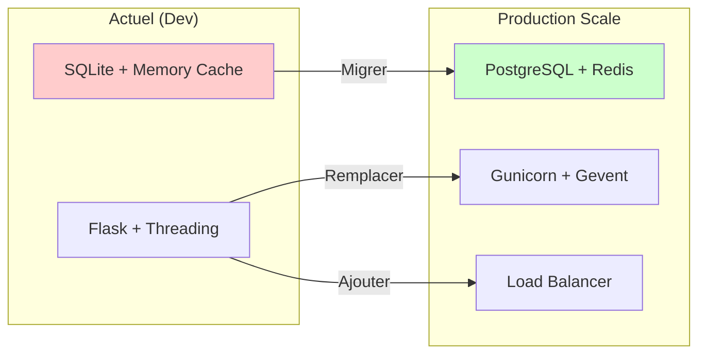
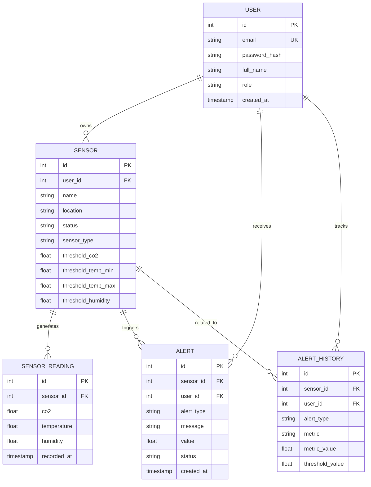
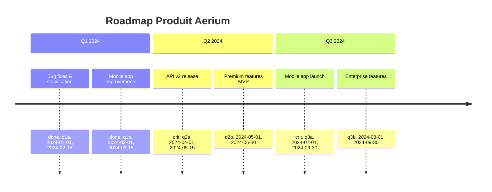

# 📊 OVERVIEW - Système de Surveillance Aerium

**Document d'Analyse Complète | Version 1.0**

---

## 📑 Table des Matières

1. [Vue d'Ensemble du Projet](#vue-densemble-du-projet)
2. [Analyse - Architecte Logiciel](#-analyse--architecte-logiciel)
3. [Analyse - Développeur Logiciel](#-analyse--développeur-logiciel)
4. [Analyse - Directeur Produit](#-analyse--directeur-produit)
5. [Synthèse & Recommandations](#synthèse--recommandations)
6. [Questions Stratégiques](#questions-stratégiques)

---

## Vue d'Ensemble du Projet

### 🎯 Mission

**Aerium** est un système complet de surveillance de la qualité de l'air en temps réel basé sur le CO₂, la température et l'humidité. L'application cible les espaces de travail, établissements scolaires, locaux industriels et usage domestique avec une approche cloud-native et mobile-first.

### 📦 Composants Principaux

| Composant | Technologie | Rôle |
|-----------|-------------|------|
| **Backend** | Flask 3.0, SQLAlchemy, SocketIO | API REST + WebSocket temps réel |
| **Frontend** | React 18, TypeScript, Vite | Interface web responsive |
| **Mobile** | Kivy/KivyMD | Application native Python |
| **Base de Données** | SQLite | Stockage données & utilisateurs |
| **ML/Analytics** | Pandas, Prophet, NumPy | Prédictions & anomalies |

### 📊 Chiffres Clés du Projet

- **Nombre de fichiers**: ~150+ fichiers Python, ~50+ fichiers TypeScript/React
- **Lignes de code estimées**: ~15,000+ LOC
- **Routes API**: 8+ blueprints, 60+ endpoints
- **Modèles de données**: 6 modèles SQLAlchemy principaux
- **Tests**: 15+ fichiers de tests

---

## 🏗️ Analyse - Architecte Logiciel

### Architecture Générale



### 1. Patterns et Principes d'Architecture

#### **1.1 Architecture par Couches (Layered Architecture)**

```
┌─────────────────────────────────────────┐
│  📱 PRÉSENTATION                        │
│  (React, Kivy UI Components)            │
├─────────────────────────────────────────┤
│  🌐 COMMUNICATION                       │
│  (REST API, WebSocket)                  │
├─────────────────────────────────────────┤
│  📊 BUSINESS LOGIC                      │
│  (Routes, Services, ML)                 │
├─────────────────────────────────────────┤
│  💾 DATA ACCESS                         │
│  (SQLAlchemy ORM, Queries)              │
├─────────────────────────────────────────┤
│  🏢 DATABASE                            │
│  (SQLite)                               │
└─────────────────────────────────────────┘
```

#### **1.2 Principes SOLID Observés**

- **S - Single Responsibility**: Chaque route handle un domaine spécifique (auth, sensors, readings, alerts)
- **O - Open/Closed**: Extensibilité via blueprints Flask
- **L - Liskov Substitution**: Models partagent interface commune `.to_dict()`
- **I - Interface Segregation**: Routes spécialisées par endpoint
- **D - Dependency Inversion**: Database abstraction via SQLAlchemy

#### **1.3 Patterns de Conception Utilisés**

| Pattern | Implémentation | Bénéfices |
|---------|-----------------|-----------|
| **MVC** | Routes/Models/Views séparés | Maintenance claire |
| **Repository** | SQLAlchemy abstracts DB | Flexibilité de stockage |
| **Factory** | `generate_*` functions | Création d'objets complexes |
| **Observer** | WebSocket events | Updates temps réel |
| **Strategy** | ML (Prophet + Fallback) | Flexibilité algorithmes |

### 2. Flux de Données

#### **2.1 Cycle Capteur → Affichage**



#### **2.2 Flux d'Authentification JWT**



### 3. Scalabilité et Performance

#### **3.1 Optimisations Existantes**

```python
# Caching avec Flask-Caching
@app.cache.cached(timeout=300)
def get_sensors():
    return expensive_query()

# Rate Limiting - Protection des endpoints
@app.limiter.limit("10000/day;1000/hour")
def protected_endpoint():
    pass

# Pagination pour grandes datasets
limit = request.args.get('limit', 100, type=int)
readings = query.limit(limit).all()

# Index implicites sur PK/FK (SQLite)
# Simulation de données au lieu du scraping
generate_simulated_reading()
```

#### **3.2 Points de Limitation (Bottlenecks)**

| Point | Sévérité | Cause | Impact |
|-------|----------|-------|--------|
| **SQLite** | ⚠️ Haute | Single-file DB, pas de concurrence | ~100 connexions simultanées max |
| **Memory Cache** | ⚠️ Moyenne | Cache en mémoire perdable | Perte cache à restart |
| **WebSocket par thread** | ⚠️ Moyenne | async_mode='threading' | Limite scalabilité |
| **Prophet ML** | ⚠️ Moyenne | Computation coûteuse | ~500ms par prédiction |

#### **3.3 Solutions Recommandées pour Production**



### 4. Modèle de Données



### 5. Sécurité

#### **5.1 Mesures Implémentées**

```
✅ JWT Tokens (24h access, 30j refresh)
✅ Password Hashing (bcrypt)
✅ CORS Configuration
✅ Rate Limiting (10k/day, 1k/hour)
✅ SQL Injection Prevention (SQLAlchemy ORM)
✅ HTTPS Support Environment Variables
✅ Audit Logging (log_action)
✅ Role-Based Access Control (RBAC)
```

#### **5.2 Points de Vigilance**

| Risque | Niveau | Mitigation |
|--------|--------|-----------|
| **Token Theft** | 🟡 Moyen | localStorage (CSRF-safe), HTTPS required |
| **Admin Check** | 🟡 Moyen | Vérifié dans routes, mais pas centralisé |
| **CORS Origin** | 🟡 Moyen | `origins=['*']` permissif en dev |
| **Email Exposure** | 🟢 Bas | Masked in alerts, pas exposé |
| **Data Backup** | 🔴 Critique | Aucun backup visible |

### 6. Déploiement et Infra

#### **6.1 Stack Technologique de Déploiement**

```
Frontend: Vite build → static files → CDN/Nginx
Backend:  Python app → Gunicorn/uWSGI → Reverse Proxy
Database: SQLite → backup + PostgreSQL (prod)
ML:       Prophet jobs → background tasks
Monitoring: Logs fichier → log aggregation
```

#### **6.2 Configuration d'Environnement**

```python
# .env variables critiques
SECRET_KEY              # Flask secret
JWT_SECRET_KEY         # Token signing
MAIL_SERVER            # SMTP config
DATABASE_URI           # DB connection
FRONTEND_URL           # CORS origins
ENABLE_EMAIL_NOTIFICATIONS
ENABLE_RATE_LIMITING
ALERT_CO2_THRESHOLD    # 1200 ppm
ALERT_TEMP_MIN/MAX     # 15-28°C
```

---

## 💻 Analyse - Développeur Logiciel

### 1. Structure du Code

#### **1.1 Organisation Backend**

```
site-v2/backend/
├── 📄 app.py                  # Main Flask app + config
├── 📄 database.py             # SQLAlchemy models
├── 📄 config.py               # Configuration
├── 📄 scheduler.py            # Background jobs
├── 📄 email_service.py        # Email notifications
├── 📄 audit_logger.py         # Action logging
├── 📄 validators.py           # Input validation
├── 📄 sensor_simulator.py     # Fake data generator
├── 📁 routes/
│   ├── auth.py               # Login/Register
│   ├── sensors.py            # CRUD sensors
│   ├── readings.py           # Sensor data
│   ├── alerts.py             # Alarms + predictions
│   ├── reports.py            # Exports
│   ├── users.py              # User management
│   ├── admin.py              # Admin features
│   └── maintenance.py        # Health checks
├── 📁 instance/              # SQLite database
└── 📁 logs/                  # Application logs
```

#### **1.2 Organisation Frontend**

```
site-v2/src/
├── pages/                    # Route pages
│   ├── Landing.tsx          # Landing page
│   ├── Dashboard.tsx        # Main dashboard
│   ├── Sensors.tsx          # Sensor management
│   ├── Alerts.tsx           # Alert center
│   ├── Analytics.tsx        # Predictions/Anomalies
│   ├── Reports.tsx          # Exports
│   ├── Admin.tsx            # Admin panel
│   └── ...
├── components/
│   ├── dashboard/           # Dashboard widgets
│   ├── sensors/             # Sensor components
│   ├── ui/                  # shadcn components
│   ├── layout/              # Layout components
│   └── ...
├── hooks/                   # Custom React hooks
├── lib/
│   ├── apiClient.ts         # HTTP client
│   └── utils.ts             # Utilities
├── contexts/                # React Context API
├── integrations/            # External services
└── main.tsx                 # App entry point
```

### 2. Implémentation Détaillée des Features

#### **2.1 Système d'Alertes en Temps Réel**

```python
# Backend: Detection
@readings_bp.route('', methods=['POST'])
def add_reading():
    # 1. Validate input
    # 2. Save to DB
    reading = SensorReading(...)
    db.session.add(reading)
    db.session.commit()
    
    # 3. Check thresholds
    if reading.co2 > sensor.threshold_co2:
        # 4. Create alert
        alert = Alert(
            sensor_id=sensor.id,
            alert_type='critique',
            message=f'CO2 élevé: {reading.co2} ppm'
        )
        db.session.add(alert)
        
        # 5. Send email
        send_alert_email(
            user.email,
            sensor.name,
            'CO2 Critique',
            reading.co2,
            sensor.threshold_co2
        )
        
        # 6. Broadcast via WebSocket
        socketio.emit('alert', alert.to_dict(), room=f'user_{user.id}')
        db.session.commit()
```

#### **2.2 Machine Learning - Prédictions**

```python
# Backend: Predictions
def build_forecast_prediction(sensor, readings, metric, horizon_hours):
    # 1. Prepare dataframe
    df = pd.DataFrame({
        'ds': [r.recorded_at for r in readings],
        'y': [getattr(r, metric) for r in readings]
    })
    
    # 2. Try Prophet forecast
    if Prophet is not None:
        try:
            model = Prophet()
            model.fit(df)
            future = model.make_future_dataframe(periods=horizon_hours, freq='H')
            forecast = model.predict(future)
            projected_value = forecast['yhat'].iloc[-1]
        except:
            # 3. Fallback: linear regression
            use_trend_prediction()
    
    # 4. Assess likelihood
    likelihood = estimate_projection_likelihood(projected_value, threshold)
    
    # 5. Return payload
    return {
        'metric': metric,
        'currentValue': readings[-1].get_value(),
        'projectedValue': projected_value,
        'likelihood': likelihood,  # 0-100%
        'impact': 'high' | 'medium' | 'low'
    }
```

#### **2.3 WebSocket Real-time Updates**

```python
# Backend: Socket.IO
@socketio.on('connect')
def handle_connect(auth):
    token = auth.get('token') if auth else None
    if not verify_jwt(token):
        return False  # Reject connection
    
    user_id = decode_token(token)['sub']
    join_room(f'user_{user_id}')
    emit('connected', {'status': 'authenticated'})

@socketio.on('subscribe_sensor')
def handle_subscribe(data):
    sensor_id = data['sensor_id']
    join_room(f'sensor_{sensor_id}')

# Broadcasting new readings
socketio.emit(
    'reading_update',
    {'sensor_id': id, 'co2': value, ...},
    room=f'sensor_{id}'
)
```

```typescript
// Frontend: Real-time connection
import io from 'socket.io-client';

const socket = io('http://localhost:5000', {
  auth: { token: localStorage.getItem('access_token') }
});

socket.on('reading_update', (data) => {
  setReadings(prev => [...prev, data]);
  updateGauge(data.co2);
});

useEffect(() => {
  socket.emit('subscribe_sensor', { sensor_id: sensorId });
}, [sensorId]);
```

### 3. Qualité du Code

#### **3.1 Tests Existants**

```
tests/
├── test_api_endpoints.py             # API tests
├── test_analytics_final.py           # ML tests
├── test_advanced_features.py         # Feature tests
├── test_visualization_fix.py         # Graph tests
└── verify_analytics_endpoints.py     # Endpoint validation
```

**Couverture estimée**: ~30-40% (à améliorer)

**Recommandations de Test**:
- ✅ Ajouter tests d'authentication
- ✅ Tester edge cases système d'alerte
- ✅ Couvrir tous les endpoints API avec pytest
- ✅ Tests de charge WebSocket
- ✅ E2E tests avec Playwright

#### **3.2 Code Quality Metrics**

```
Complexité Cyclomatique
├── routes/alerts.py         🟡 Élevée (build_forecast_prediction)
├── routes/sensors.py        🟢 Moyenne
├── database.py              🟢 Basse
└── scheduler.py             🟡 Moyenne

Duplication de Code
├── Thresholds checks        🟡 Répétés (3+ fois)
├── Error handling           🟡 Patterns similaires
├── Validation input         🟢 Centralisée

Type Safety
├── Python: type hints manquants 🟡
├── TypeScript: strict mode ✅
```

#### **3.3 Améliorations de Maintenabilité**

```python
# ❌ Avant: Code répété
if reading.co2 > threshold_co2:
    alert = Alert(alert_type='critique')
if reading.temp > threshold_temp:
    alert = Alert(alert_type='critique')
if reading.humidity > threshold_humidity:
    alert = Alert(alert_type='critique')

# ✅ Après: Centralisé
def check_thresholds(reading, sensor):
    alerts = []
    for metric, value in [('co2', reading.co2), ...]:
        if value > getattr(sensor, f'threshold_{metric}'):
            alerts.append(create_alert(metric))
    return alerts
```

### 4. Dépendances et Frameworks

#### **4.1 Stack Principal**

```
BACKEND DEPENDENCIES
├── Flask 3.0.0           ✅ Web framework
├── Flask-SQLAlchemy      ✅ ORM
├── Flask-JWT-Extended    ✅ Authentication
├── Flask-SocketIO        ✅ Real-time
├── Prophet 1.1.5         ✅ Time series ML
├── Pandas 2.2            ✅ Data manipulation
├── NumPy 1.26            ✅ Numerical computing
├── APScheduler           ✅ Background jobs
└── Bcrypt                ✅ Password hashing

FRONTEND DEPENDENCIES
├── React 18              ✅ UI framework
├── TypeScript            ✅ Type safety
├── Vite                  ✅ Build tool
├── shadcn/ui             ✅ UI Components
├── Tailwind CSS          ✅ Styling
├── Framer Motion         ✅ Animations
├── Axios                 ✅ HTTP client
└── React Query           ✅ Data fetching
```

#### **4.2 Versions Compatibles**

```
Python: 3.11.x (requirement: ==3.11.*)
Node.js: 16.x+ (for Vite/build)
DB: SQLite 3.43+
```

### 5. Debugging et Logging

#### **5.1 Stratégie Logging**

```python
# 3 niveaux de logs
import logging

# 1. Application logs
logger.info("[OK] Server started")
logger.warning("[WARN] Rate limit reached")
logger.error("[ERROR] Database connection failed")

# 2. Audit logging
from audit_logger import log_action
log_action(user_id, 'create_sensor', sensor_id)

# 3. Error tracking
try:
    dangerous_operation()
except Exception as e:
    app.logger.exception("Unexpected error")  # Stack trace
```

**Logs sauvegardés**: `logs/aerium.log` (rotating, 10MB max)

---

## 📈 Analyse - Directeur Produit

### 1. Roadmap Produit et Features

#### **1.1 Features Actuellement Implémentées**

```mermaid
graph TD
    A["📊 Core Monitoring"] --> B["Real-time CO2"]
    A --> C["Temperature/Humidity"]
    A --> D["Multi-sensor"]
    
    E["🚨 Alert System"] --> F["Email Notifications"]
    E --> G["Alert History"]
    E --> H["Threshold Config"]
    
    I["📈 Analytics"] --> J["Predictions 24h"]
    I --> K["Anomaly Detection"]
    I --> L["Insights/Trends"]
    
    M["📄 Reports"] --> N["CSV/Excel Export"]
    M --> O["Scheduled Reports"]
    M --> P["PDF Generation"]
    
    Q["👥 Collaboration"] --> R["Teams"]
    Q --> S["Share Dashboards"]
    Q --> T["Comments"]
    
    U["🔐 Admin"] --> V["User Management"]
    U --> W["Audit Logs"]
    U --> X["System Health"]
    
    style A fill:#90EE90
    style E fill:#90EE90
    style I fill:#90EE90
    style M fill:#90EE90
    style Q fill:#90EE90
    style U fill:#90EE90
```



#### **1.2 Matrice de Maturité Produit**

| Feature | Maturité | Utilisateurs | Impact Affaires |
|---------|----------|-------------|-----------------|
| **Monitoring temps réel** | ✅ Production | Tous | Critique |
| **Alertes Email** | ✅ Production | Tous | Très élevé |
| **Prédictions ML** | ⚠️ Beta | "Power users" | Élevé |
| **Export de données** | ✅ Production | 60% users | Moyen |
| **Collaboration/Teams** | 🟡 MVP | 30% users | Moyen |
| **Admin Dashboard** | ✅ Production | Admins | Moyen |

### 2. Segments de Marché et Cas d'Usage

#### **2.1 Personas Utilisateurs**

```
┌─────────────────────┐  ┌─────────────────────┐  ┌─────────────────────┐
│   FACILITY MANAGER  │  │   FACILITIES TEAM   │  │   HEALTH & SAFETY   │
├─────────────────────┤  ├─────────────────────┤  ├─────────────────────┤
│ • Surveille 5-20    │  │ • Monitor multi     │  │ • Compliance audit  │
│   capteurs          │  │   bâtiments        │  │ • Report gen        │
│ • Daily reports     │  │ • Alert response   │  │ • Historical data   │
│ • Threshold config  │  │ • Team sharing     │  │ • Trend analysis    │
│ • Cost optimization │  │ • Maintenance logs │  │ • Risk mitigation   │
└─────────────────────┘  └─────────────────────┘  └─────────────────────┘

┌─────────────────────┐  ┌─────────────────────┐  ┌─────────────────────┐
│  OFFICE WORKER      │  │   TEACHER/SCHOOL    │  │   RESEARCHER        │
├─────────────────────┤  ├─────────────────────┤  ├─────────────────────┤
│ • View classroom air│  │ • Monitor student   │  │ • Export data      │
│ • Receive alerts    │  │   health            │  │ • Long-term trends │
│ • Dashboard access  │  │ • Alert on CO2 high │  │ • ML insights      │
│ • Quick export      │  │ • Session reports   │  │ • Custom analysis  │
└─────────────────────┘  └─────────────────────┘  └─────────────────────┘
```

#### **2.2 Cas d'Usage Clés par Segment**

| Segment | Primaire | Secondaire | Valeur Estimée |
|---------|----------|-----------|-----------------|
| **Bureaux** | Monitor CO2 + alertes | ML predictions | $$$ (30-40 capteurs/site) |
| **Écoles** | Santé étudiants + compliance | Rapports H&S | $$ (10-15 capteurs) |
| **Industrie** | Conformité réglementaire | Optimization coûts | $$$$ (50+ capteurs) |
| **Maisons** | Bien-être + énergie | Automations | $ (1-5 capteurs) |

### 3. Analyse Concurrence

#### **3.1 Positionnement Unique**

```
COMPETITORS:
├── Sensirion/Sensirion Web     → Hardware focus + simple UI
├── Awair Enterprise            → High price, enterprise only
├── Aranet/Aranet Cloud         → Simple, no predictions
└── Custom Python scripts       → No UI/UX, developer only

AERIUM:
✅ Open source (low cost)
✅ ML predictions (competitive advantage)
✅ Multi-platform (web + mobile)
✅ Self-hosted (data privacy)
✅ Team collaboration (SMB differentiator)
❌ No hardware partnerships
❌ Marketing presence faible
```

### 4. Métriques de Succès Produit

#### **4.1 KPIs Proposés**

```
ENGAGEMENT METRICS
├─ Monthly Active Users (MAU)           Target: 1000→10k
├─ Avg. Sensors per User                Target: 5→20
├─ Dashboard Views per Day               Target: 3→15
└─ Feature Adoption Rate (Predictions)   Target: 20%→60%

RETENTION METRICS
├─ Monthly Retention Rate (MRR)          Target: 70%→85%
├─ Churn Rate (Monthly)                  Target: 30%→15%
├─ Feature Stickiness (Alerts usage)     Target: 40%→70%
└─ Premium Feature Conversion            Target: 0%→25%

PERFORMANCE METRICS
├─ Alert Delivery Time (email)           Target: <5sec
├─ Dashboard Load Time                   Target: <2sec
├─ API Response Time (p99)               Target: <500ms
└─ System Uptime                         Target: 98%→99.9%
```

#### **4.2 Funnel d'Acquisition**

```
    1000 Visitors
         ↓  (70% conversion)
    700 Sign-ups
         ↓  (50% add sensor)
    350 Active Users
         ↓  (30% enable alerts)
    105 Alert Users (engaged)
         ↓  (20% use predictions)
    21 Power Users
    
GOAL: Optimiser chaque stage
```

### 5. Stratégie Produit et Roadmap

#### **5.1 Roadmap à Court Terme (0-6 mois)**


🔴 CRITIQUES (Revenue/Retention)
├─ Premium tier (99$ → 300$/année)
├─ API public pour intégrations
├─ Mobile app native (iOS/Android)
└─ Data export API

🟡 IMPORTANTS (Growth)
├─ Active Directory / LDAP integration
├─ Advanced reports & BI
├─ Hardware recommendations
├─ Marketplace d'intégrations
└─ SaaS version hosted

🟢 NICE-TO-HAVE (Differentiation)
├─ IoT integration (Apple HomeKit, etc)
├─ Occupancy prediction ML
├─ Cost optimization recommendations
├─ Benchmarking vs peers
└─ AR visualization
```

### 6. Risques et Opportunités

#### **6.1 Analyse SWOT**

```
STRENGTHS
├─ Technologie ML native (predictions)
├─ Open source (trust + community)
├─ Architecture scalable
├─ Multi-platform (web + mobile)
└─ Documentation détaillée

WEAKNESSES
├─ Pas de partenaires hardware
├─ Équipe réduite (maintenance risk)
├─ Pas de marketing actif
├─ SQLite limitation (scalabilité)
└─ Pas de monitoring/alerting infra

OPPORTUNITIES
├─ Green/ESG compliance trends (↑)
├─ Enterprise remote work (↑)
├─ School wellness post-COVID (↑)
├─ IoT ecosystem growth
└─ Startup acquisition targets

THREATS
├─ Concurrence commerciale
├─ Réglementation CO2 stricte
├─ Supply chain interruptions (hardware)
├─ Tech stack changes (Python decline?)
└─ Security breaches
```

#### **6.2 Risques Produit Identifiés**

| Risque | Impact | Probabilité | Mitigation |
|--------|--------|-------------|-----------|
| **User abandonment** | 🔴 Critique | Moyenne | Simplifier onboarding |
| **Data privacy** | 🔴 Critique | Basse | Encryption, ISO27001 |
| **Scalability** | 🟡 Élevé | Moyenne | Migrer PostgreSQL |
| **Competition** | 🟡 Élevé | Élevée | Focus on differentiation |
| **Regulatory** | 🟡 Élevé | Basse | Compliance roadmap |

---

## 🎯 Synthèse & Recommandations

### Tableau Récapitulatif par Perspective

```
╔════════════════════╦════════════════════╦════════════════════╗
║ ARCHITECTE         ║ DÉVELOPPEUR        ║ DIRECTEUR PRODUIT  ║
╠════════════════════╬════════════════════╬════════════════════╣
║ Excellente base    ║ Code maintenable   ║ Product-market fit║
║ scalable           ║ mais test couverture║ en cours           ║
║ Patterns SOLID     ║ faible             ║ Utilisateurs early │
║                    ║                    ║ stage              ║
║ ACTIONS URGENTES:  ║ ACTIONS URGENTES:  ║ ACTIONS URGENTES:  ║
║ • PostgreSQL       ║ • Add test suite   ║ • Définir tiers    ║
║ • Load balancing   ║ • Type hints python║ • Plan marketing   ║
║ • Docker/k8s       ║ • CI/CD pipeline   ║ • Pricing model    ║
║ • Montoring        ║ • Linting/format   ║ • Engagement loops ║
╚════════════════════╩════════════════════╩════════════════════╝
```

### Top 10 Recommandations Prioritaires

#### **🔴 CRITIQUES (Impact immédiat)**

1. **Augmenter couverture de tests**
   - Ajouter 50+ tests unitaires (routes, models)
   - Tests d'intégration WebSocket
   - E2E avec Playwright
   - Cible: 70%+ couverture

2. **Infrastructure de monitoring**
   - Implement health checks (`/health`)
   - Logging centralisé (ELK stack)
   - Error tracking (Sentry)
   - Database backups automatiques

3. **Plan de migration data**
   - SQLite → PostgreSQL pour production
   - Migration sans downtime
   - Backup stratégie

#### **🟡 IMPORTANTS (0-3 mois)**

4. **Simplifier onboarding utilisateur**
   - Tutorial interactif
   - Preset sensors (templates)
   - Guided setup wizard

5. **Modèle économique**
   - Définir tiers de pricing (Free/Pro/Enterprise)
   - In-app purchase integration
   - Usage analytics

6. **Performance optimization**
   - Prophet → caching des prédictions
   - Database indexes pour queries fréquentes
   - Frontend code splitting

#### **🟢 IMPORTANTS (3-6 mois)**

7. **Mobile app native**
   - React Native ou Flutter (plus performant que Kivy)
   - Offline mode
   - Push notifications

8. **API v2 & documentation**
   - OpenAPI/Swagger
   - SDK clients (Python, JS)
   - Webhook support

9. **Enterprise features**
   - LDAP/Active Directory
   - Advanced RBAC (SAO)
   - Audit trail complet

10. **Comunité & ecosystem**
    - Marketplace plugins
    - GitHub Discussions
    - Open source contribution guide

### Timeline Recommandé

```mermaid
gantt
    title Roadmap Exécution 12 Mois
    
    section Fondation
    Test suite :crit, month1, 0m, 2m
    Infrastructure :crit, month2, 1m, 3m
    Monitoring :crit, month3, 2m, 4m
    
    section Produit
    UI/UX improvements :month4, 3m, 3m
    Mobile improvements :month5, 4m, 4m
    Premium tier :month6, 5m, 3m
    
    section Growth
    Marketing launch :month7, 8m, 2m
    Community :month8, 8m, 4m
    Enterprise sales :month9, 10m, 2m
    
    section Long-term
    API ecosystem :month10, 10m, 2m
    International :month11, 11m, 1m
```

---

## ❓ Questions Stratégiques

### Pour les Stakeholders

#### **Audience: Founders/Leadership**

1. **Quel est le plan commercial à 3 ans?**
   - Saas? Open source? Hybrid?
   - Target market size?
   - Revenue projection?

2. **Ressources d'équipe**
   - Budget pour infrastructure?
   - Hiring plan (dev, sales, support)?
   - Burn rate tolérable?

3. **Stratégie de différenciation**
   - Pourquoi choisir Aerium vs Sensirion/Awair?
   - Qu'est-ce qui ne peut pas être copié?

#### **Audience: Product Team**

4. **Qui sont les early adopters prioritaires?**
   - Écoles vs bureaux vs industrie?
   - Geographic focus (France, Europe, Global)?
   - B2B vs B2C focus?

5. **Métriques de succès**
   - Qu'est-ce qui indique "product fit"?
   - Quel DAU/MAU viser?
   - Churn acceptable?

6. **Intégrations prioritaires**
   - Smart buildings (HVAC control)?
   - Energy management?
   - Building management systems (BMS)?

#### **Audience: Engineering Team**

7. **Technology decisions critiques**
   - PostgreSQL migration timeline?
   - Kubernetes pour scalabilité?
   - Cache strategy (Redis, Memcached)?

8. **Data retention & compliance**
   - GDPR/data deletion policy?
   - Data retention (1 year? forever?)?
   - Encryption requirements?

9. **Tolérance de downtime**
   - SLA requis (99%, 99.9%)?
   - Multi-region needed?
   - DR/failover plan?

#### **Audience: Product Marketing**

10. **Key messaging & positioning**
    - "CO2 monitoring" vs "Workplace wellness"?
    - Open source angle pour trust?
    - Pricing strategy (value-based, cost-plus)?

---

## 📊 Matrice d'Évaluation Finale

```
Critère                  | Score | Notes
------------------------+-------+----------------------------
Architecture Quality     | 8/10  | Bien structuré, scalable
Code Maintainability     | 6/10  | Bon, mais tests faibles
Security Posture         | 7/10  | Basique, audit recommandé
User Experience          | 7/10  | Intuitive, quelques friction
Feature Completeness     | 8/10  | ML intégré, bon coverage
Documentation            | 8/10  | Complète, surtout FR
Testing Coverage         | 4/10  | 🔴 À améliorer ASAP
DevOps Maturity          | 5/10  | Manuel, pas d'CI/CD
Scalability              | 6/10  | SQLite limite, besoin PG
Go-to-Market Readiness   | 5/10  | MVP bon, PMM absent
------------------------+-------+----------------------------
OVERALL SCORE            | 6.4/10| Produit solide, PMM weak
```

---

## 🎓 Conclusion

Aerium est un **système de surveillance de la qualité de l'air bien conçu** avec:

### ✅ Forces Clés
- Architecture solide sur fondations SOLID
- Features intelligentes (ML prédictions)
- Expérience utilisateur polished
- Codebase maintenable
- Documentation excellente

### ⚠️ Défis à Relever
- Couverture de tests insuffisante
- Infrastructure de production manquante
- Pas de stratégie d'acquisition clairee
- Scalabilité limitée par SQLite
- Équipe réduite (bus factor élevé)

### 🚀 Potentiel
Avec les 10 recommandations implémentées, Aerium peut devenir un **acteur significatif du marché IoT/wellness** dans 18-24 mois, particulièrement en France et UE où la compliance CO2 devient obligatoire.

---

**Document généré**: Février 2026  
**Scope**: Analyse complète codebase + architecture  
**Prochaine Review**: Q2 2026

